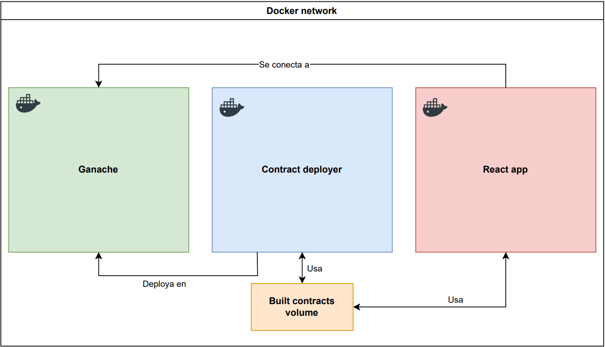

# Extrimian - Desafío técnico

## Descripción general
Para resolver el desafío opté por intentar dockerizar la totalidad de la aplicación para poder hacerla funcionar localmente de la forma más sencilla que se pueda. 
Utilicé 3 containers:
- Uno se encarga de levantar **Ganache**. Para esto usé una imagen ya existente y sobreescribí el comando principal para lograr que el puerto y el ID de la red sean configurables.
- Otro container se encarga de la compilación y el deploy del contrato usando **Truffle**.
- El último container se encarga de levantar la aplicación de **React**. La build obtenida luego de la compilación en el container anterior es almacenada en un volumen compartido, por lo cual este container tiene acceso al archivo .json que se necesita para obtener la instancia del contrato y poder interactuar con él desde la aplicación React. Para esto último usé **Ethers**.
## Diagrama de la solución

## Tecnologías utilizadas
- Docker
- Solidity
- Truffle
- Ganache
- React
- Ethers
## Implementación
Para levantar el proyecto, se requiere tener **Docker** instalado.  
Los valores por defecto utilizados son:
- **Id de la red**: 1995
- **Puerto de la aplicación React**: 3000
- **Puerto de Ganache**: 8545

Estos valores se pueden cambiar en el archivo de configuración `.env` ubicado en el directorio raíz del proyecto.

Teniendo **Docker** instalado:
- Ubicarse en el directorio raíz del proyecto.
- Ejecutar el comando `docker-compose up -d`
- Abrir el navegador y dirigirse a http://localhost:3000

